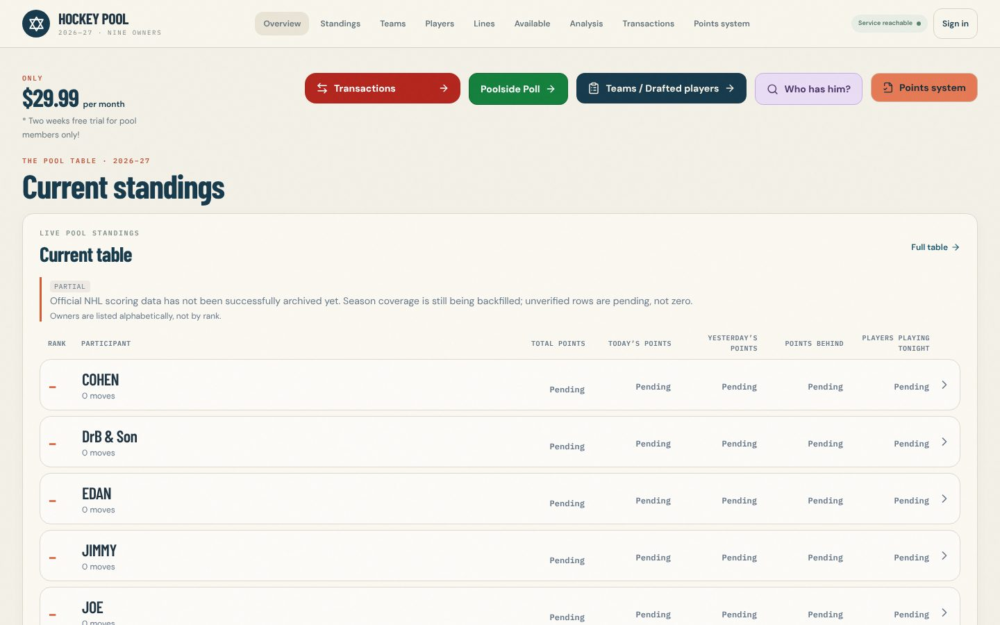
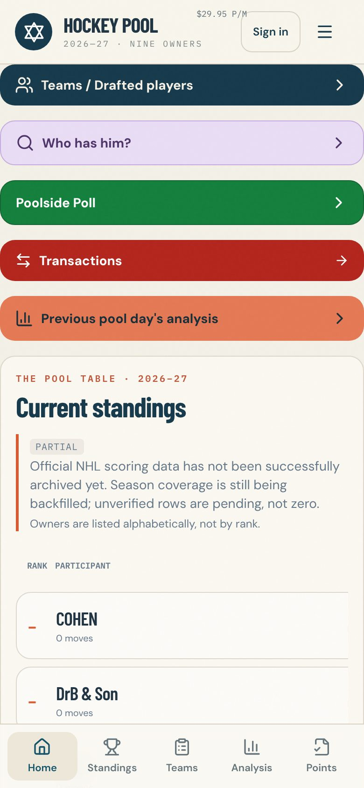

# Hockey Pool 2026–27 — independent copy

A separate, self-hostable copy of the Hockey Pool 2026–27 website (desktop and
mobile), rebuilt from the original project's source files. It has its **own**
database, configuration and deployment. It does not connect to, read from, or
change the original Replit app, its database or its services.

Layouts, pages, scoring rules, transaction accounting and admin features are
unchanged. The website's compiled stylesheet is byte-identical to the original
production build, and the compiled JavaScript differs only by the Clerk key
string (see *Verification*).

| Desktop | Mobile |
| --- | --- |
|  |  |

More screenshots: [`docs/screenshots/`](docs/screenshots/). They were taken
against an empty copy database with live NHL data switched off, so scoring
shows *Pending*.

## What's in the workspace

pnpm monorepo, TypeScript throughout.

| Path | What it is |
| --- | --- |
| `artifacts/hockey-pool` | Website: React 19, Vite 7, Tailwind 4, shadcn/ui, wouter, TanStack Query, Clerk |
| `artifacts/api-server` | API: Express 5, Drizzle ORM, Clerk; NHL / injury / catalog refresh; OpenAI daily report |
| `lib/db` | Drizzle schema (11 tables) and Postgres pool |
| `lib/api-spec` | OpenAPI spec + Orval codegen config |
| `lib/api-zod`, `lib/api-client-react` | Generated Zod schemas / React Query client (+ client helpers and tests) |
| `lib/pool-calendar` | Toronto 2 a.m. pool-day boundary |
| `lib/integrations-openai-ai-server` | OpenAI client used by the daily report |

## Requirements

- Node.js 22 or newer (the original used Node 24). pnpm 10.
- PostgreSQL 14+ — **a new, empty database for this copy**.
- A **new** Clerk application for this copy (free development tier works for testing).
- Optional: an OpenAI API key (paid) if you want the 8:00 a.m. daily report.
- Outbound HTTPS from the server to the public NHL/news sources once live data is
  enabled: `api-web.nhle.com`, `search.d3.nhle.com`, `site.api.espn.com`,
  `www.espn.com`, `www.cbssports.com`, `www.nhl.com`.

## Setup

```sh
pnpm install
cp .env.example .env          # fill in placeholders — this copy's own services only
set -a; . ./.env; set +a      # or use your host's secret manager

pnpm run db:push              # create tables in the copy's empty database
pnpm run db:seed              # load the nine original draft boards (idempotent)
pnpm run build:web            # website  -> artifacts/hockey-pool/dist/public
pnpm run build:api            # API      -> artifacts/api-server/dist
pnpm start                    # one process serves /api and the website on $PORT
```

For development with hot reload, run the API (`pnpm --filter @workspace/api-server run dev`)
and the website (`pnpm --filter @workspace/hockey-pool run dev`); Vite proxies
`/api` to `API_PROXY_TARGET` (default `http://127.0.0.1:8080`).

`pnpm run db:push` uses `drizzle-kit push` against `DATABASE_URL`. Check that
variable before running it. The original's automatic post-merge `db push`
script was removed on purpose.

## Environment variables

All values in `.env.example` are placeholders.

| Variable | Required | Purpose |
| --- | --- | --- |
| `DATABASE_URL` | yes | This copy's Postgres database |
| `PORT` | yes (API) | API port (also serves the website when `FRONTEND_DIST` is set) |
| `FRONTEND_DIST` | for single-server | Path to the built website, e.g. `artifacts/hockey-pool/dist/public` |
| `CLERK_SECRET_KEY` | yes | Secret key of the copy's Clerk app (the API refuses requests without it, as in the original) |
| `CLERK_PUBLISHABLE_KEY` | yes | Publishable key (API side) |
| `VITE_CLERK_PUBLISHABLE_KEY` | yes, at build time | Publishable key baked into the website build |
| `VITE_CLERK_PROXY_URL` | optional | Clerk frontend API URL. If unset, production builds use `<origin>/api/__clerk` (the original's Replit-managed proxy mode; requires Clerk proxy configuration) |
| `POOL_ADMIN_EMAIL` | recommended | Verified email of the pool administrator. Defaults to the original administrator's email |
| `POOL_PARTICIPANT_EMAILS` | for sign-in | JSON `{"<owner id>":"email", …}`; owner ids: `cohen, weezbark, rob, korm, edan, joe, drb-and-son, nana, jimmy` |
| `ENABLE_BACKGROUND_JOBS` | no (default off) | `true` starts NHL refresh (every 5 min), injury check (daily 8 a.m. Toronto) and player-catalog refresh |
| `ENABLE_DAILY_REPORT` | no (default off) | `true` starts the 8:00 a.m. Toronto OpenAI daily report |
| `OPENAI_API_KEY`, `OPENAI_BASE_URL` | only for the report | OpenAI credentials (`AI_INTEGRATIONS_OPENAI_*` also accepted) |
| `DAILY_REPORT_MODEL` | optional | Default `gpt-5.6-terra` (the original's model, likely only available through Replit's AI proxy) |
| `BASE_PATH`, `API_PROXY_TARGET` | optional | Website base path (default `/`) and dev proxy target |
| `NODE_ENV`, `LOG_LEVEL` | optional | Standard |

### Safety switches

Scheduled jobs and the OpenAI report are **off by default**. With both off, the
copy makes no outbound calls on a timer and never calls OpenAI. Some pages still
fetch public NHL data on demand (transaction preview checks the club schedule).
Turn on `ENABLE_BACKGROUND_JOBS` only after the copy's database and connections
are verified, and `ENABLE_DAILY_REPORT` only after deciding to pay for OpenAI.

## Tests

```sh
export DATABASE_URL=...   # the copy's database (tests roll back their own fixtures)
pnpm run db:seed
pnpm test                 # 273 tests: API, website hooks, pool calendar, API client
pnpm run typecheck
```

One test, *admin scoring updates … cutoff guard*, needs a roster that already
has a completed pickup. That exists only after a real transaction, so on a fresh
copy database it fails with *"An existing pickup is needed…"*. It passed in a
throwaway database holding one labelled synthetic pickup, which was then deleted.

`artifacts/hockey-pool/tests/production` (`pnpm --filter @workspace/hockey-pool run smoke:production`)
is the original browser smoke test with synthetic fixtures; it needs a Clerk
development `pk_test_` key and internet access. `tests/mobile-alerts` targets
Replit's Expo preview and does not apply to this copy.

## Changes from the original (all needed for independence)

1. **Background jobs and the OpenAI daily report are disabled by default** (`ENABLE_BACKGROUND_JOBS`, `ENABLE_DAILY_REPORT`).
2. **OpenAI client is created lazily** and accepts standard `OPENAI_API_KEY`, so the API starts without OpenAI credentials (the original threw at startup). The daily report model is configurable.
3. **Admin email is configurable** (`POOL_ADMIN_EMAIL`); the default is unchanged.
4. **Replit dependencies removed:** `@replit/connectors-sdk` (unused), the three `@replit/vite-plugin-*` dev plugins, and the linux-x64-only platform overrides (so it installs on macOS, Windows and ARM).
5. **Routing without Replit:** the API can serve the built website (`FRONTEND_DIST`), mounted before Clerk the way Replit's separate static server was. Vite gets an `/api` dev/preview proxy, and `PORT`/`BASE_PATH` have defaults.
6. **Removed** `scripts/post-merge.sh` (it ran an automatic `db push`) and 16 stale, unreferenced duplicate files in `artifacts/api-server/src/middlewares/` (byte-identical copies of `src/lib/*` that broke the typecheck; nothing imported them).
7. **Added** `pnpm` root scripts (`test`, `db:push`, `db:seed`, `build:*`, `start`), the `seed-rosters.ts` script, `.env.example` and `.gitignore`.

No scoring values, rules, layouts, text or features were changed.

## Verification performed

- Every source file was recovered from the original project; generated Orval
  output reproduces the original generated files byte-for-byte.
- `pnpm run typecheck` passes for all packages. API and website build.
- Website build vs. original production build: CSS byte-identical (same hash);
  `index.html` identical; JS identical in length, differing only in minifier
  identifier names caused by the different Clerk key string.
- 272 of 273 tests pass on a fresh isolated Postgres 16; the remaining one passes with
  the synthetic pickup described above.
- The API ran against the isolated database with jobs off; all read endpoints
  returned 200. Desktop (1440×900) and phone (390×844) screenshots taken of
  overview, standings, teams, transactions and points pages.

## Not yet verified / needs your input

- **Sign-in, participant swaps and admin pages** need a real Clerk application for
  this copy. With placeholder keys, Clerk does not load, so signed-in views were not exercised.
- **Live NHL scoring, injuries and the available-player catalog**: the build
  environment blocks `api-web.nhle.com`, so scoring stayed *Pending*. Enable
  `ENABLE_BACKGROUND_JOBS` on a host with internet access to verify.
- **Daily report**: needs an OpenAI key, a paid service, and `gpt-5.6-terra` may not exist outside Replit.
- **Existing season data** (transactions, payments, polls, scoring-rule revisions,
  participant links, past daily reports) lives only in the original database and
  was **not** copied. The copy starts from the nine original draft boards.
- Hosting/deployment and public publishing have not been set up.
